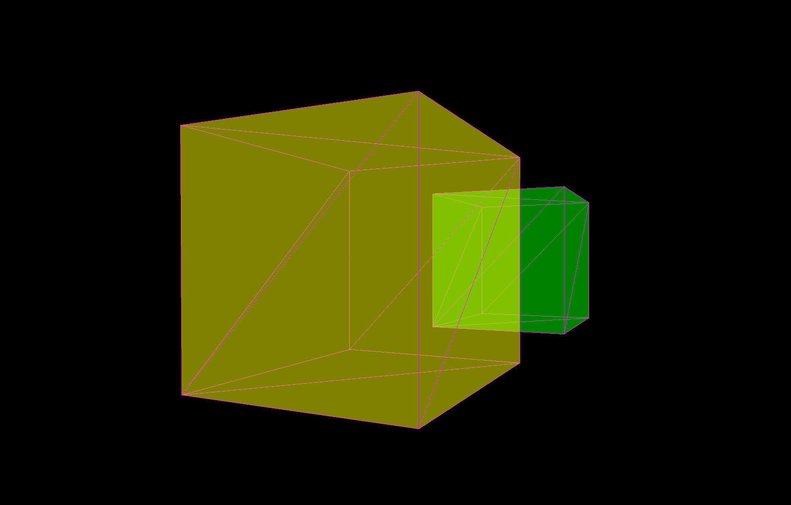

<h1>Prototype3D</h1>

<b>Prototype3D is a free 3D real-time rendering engine that I have been working on in my spare time as a hobby</b>

    

<table>
    <tr>
        <td></td>
        <td></td>
    </tr>
    <tr>
        <td></td>
        <td></td>
    </tr>
    <tr>
        <td></td>
        <td></td>
    </tr>
</table>

<h2>Current features</h2>
<ul>
    <li>D3D11 renderer</li>
    <li>Forward lighting (point lights) with Phong reflection model</li>
    <li>Texturing</li>
    <li>Transparency</li>
    <li>Normal mapping</li>
    <li>MSAA</li>
    <li>Anisotropic filtering</li>
    <li>Scene builder API</li>
    <li>Loading .obj and .dae files into a custom scene format</li>
    <li>Support for .DDS textures (compressed and uncompressed)</li>
    <li>Bounding volumes</li>
    <li>Scene debugging</li>    
    <li>Multi-API architecture</li>
</ul>

<h2>Planned features</h2>
<ul>
    <li>Support for direction and spot lights</li>
    <li>Shadows</li>
    <li>Screen-space ambient occlusion (SSAO)</li>
    <li>Octree and frustum culling</li>
    <li>Scene builder gizmos (position, rotation, etc)</li>
</ul>

